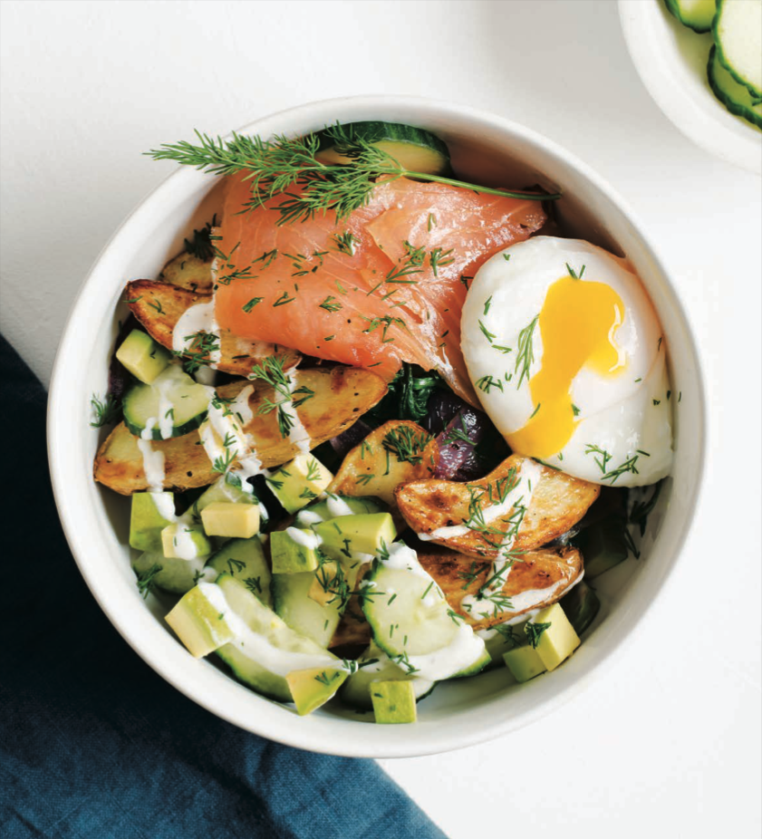

# Crispy Potato and Smoked Salmon Power Bowls

## Overview
With smoked salmon and red onion, poached eggs, greens, and crispy potatoes, gilded in a lemony sauce, this recipe brings together some quintessential New York brunch foods in a single bowl. And while not commonly paired together as they are here, each one plays off the other in such a harmonious and delicious way. This is a bowl I would happily start my morning with, any day of the week, and particularly if I had company or was hosting weekend brunch.

## Scaling Notes
**Scaling Applied**: 2x for dinner + lunch leftovers
**Original Servings**: 4 | **Adjusted Servings**: 8 (4 dinner + 4 lunch leftovers)
**Ingredient Adjustments**:
- Fingerling potatoes replaced with 500g baby potatoes
- Smoked salmon replaced with 660g baked salmon fillets (6 fillets at 110g each)
- Eggs changed from poached to hard-boiled for easier meal prep/storage
- Cooking time increased to 40 minutes to accommodate larger quantities and roasting method

## Meal Tags
Breakfast | Brunch | Lunch | Dinner | Gluten-Free | High-Protein | Power Bowl

## Ingredients

### Bowl Components
- 500g baby potatoes (halved, for roasting)
- 1 large red onion, cut into large pieces
- 4 tablespoons (60 ml) avocado oil, divided
- 200g baby spinach (approximately 6-7 packed cups)
- 6 salmon fillets (660g total at ~110g each), seasoned for baking
- 8 large eggs, hard-boiled
- 1 English cucumber, halved and thinly sliced
- 2 medium avocados, peeled, pitted, and diced
- Fresh dill for garnish
- Kosher salt and freshly ground black pepper to taste

### Lemon Yogurt Sauce
- 1 cup (240 g) plain Greek yogurt
- ¼ cup (60 ml) water
- 1 tablespoon (15 ml) extra-virgin olive oil
- 1 clove garlic, minced
- Kosher salt and freshly ground black pepper to taste

## Instructions

### Prepare the Sauce (Can be made ahead)
1. In a small bowl, combine Greek yogurt, water, extra-virgin olive oil, and minced garlic
2. Whisk until smooth and creamy
3. Season with salt and pepper to taste
4. Refrigerate until ready to serve (keeps 3-4 days)

### Roast Potatoes and Onions
1. Preheat oven to 425°F (220°C)
2. Toss baby potatoes and red onion with 2 tablespoons (30 ml) avocado oil, salt, and pepper
3. Spread in a single layer on a rimmed baking sheet
4. Roast for 20-25 minutes until golden and crispy around edges, stirring halfway through

### Bake Salmon
1. Place salmon fillets on a separate baking sheet, skin-side down
2. Drizzle with remaining 2 tablespoons (30 ml) avocado oil
3. Season with salt and pepper
4. Bake at 400°F (200°C) for 12-15 minutes until cooked through and flakes easily with a fork
5. *Note: Coordinate baking with potatoes or adjust oven temperature to 400°F and extend potato roasting to 30 minutes*

### Prepare Spinach
1. Heat a large skillet over medium heat
2. Add baby spinach with a pinch of salt
3. Cook, tossing occasionally, until wilted (2-3 minutes)
4. Drain any excess moisture

### Prepare Eggs

#### Option 1: Hard-Boiled (for meal prep or next-day serving)
1. Bring a pot of water to a rolling boil
2. Carefully lower eggs into boiling water
3. Cook for 11-12 minutes for fully set yolks
4. Transfer to ice-cold water bath for 2-3 minutes to stop cooking
5. Peel gently and halve or keep whole for assembly
6. *Best for storing in fridge 3-4 days; safe to eat the next day cold or reheated*

#### Option 2: Soft-Boiled (for fresh serving)
1. Bring a pot of water to a rolling boil
2. Carefully lower eggs into boiling water
3. Cook for 6-7 minutes for a runny yolk with set whites (6.5 min is sweet spot)
4. Transfer to ice-cold water bath for 1-2 minutes to stop cooking just enough
5. Serve immediately in an egg cup and cut off the top, or peel gently for assembly
6. *Best enjoyed fresh—runny yolks degrade quickly if stored*

### Assemble Bowls
1. Divide roasted potatoes, onions, and wilted spinach among serving bowls
2. Top with baked salmon fillet, eggs (halved or whole), cucumber slices, and avocado
3. Drizzle generously with Lemon Yogurt Sauce
4. Garnish with fresh dill and additional salt and pepper to taste
5. *For soft-boiled eggs: serve immediately so the runny yolk is still warm and runny*

## Metadata

| Field | Value |
|-------|-------|
| **Servings** | 8 (4 dinner + 4 lunch leftovers) |
| **Prep Time** | 20 minutes |
| **Cook Time** | 40 minutes (includes roasting, baking, and cooking spinach) |
| **Total Time** | 60 minutes |
| **Difficulty** | 2/5 (straightforward; main technique is coordinating oven temps) |
| **Cuisine** | American (New York Brunch) |
| **Dietary** | Gluten-Free, High-Protein |
| **Tags** | breakfast, brunch, lunch, dinner, salmon, power bowl, meal prep friendly |
| **Source** | Cookbook (brunch-focused) |

## Nutrition Information (Per Serving with Sauce)

*Includes all components: potatoes, onion, spinach, baked salmon, egg, cucumber, avocado, and Lemon Yogurt Sauce*

| Nutrient | Per Serving |
|----------|------------|
| Calories | 510 |
| Protein | 42.0g |
| Carbohydrates | 32.0g |
| Fat | 28.0g |
| Fiber | 6.5g |
| Saturated Fat | 6.0g |
| Calcium | 165mg |
| Iron | 3.2mg |
| Magnesium | 98mg |
| Potassium | 1050mg |
| Vitamin C | 22mg |
| Vitamin A | 380 IU |
| Vitamin D | 660 IU |

**Nutritional Breakdown Notes:**
- Sauce contribution: ~60 calories, 8g protein (Greek yogurt), minimal carbs
- Salmon provides omega-3 fatty acids and high-quality protein
- Baby potatoes and spinach provide fiber and micronutrients (iron, magnesium, potassium)
- Avocado adds healthy fats and fiber
- Hard-boiled eggs provide additional protein and choline for easy meal prep

## Storage & Meal Prep Notes

### Leftovers & Reheating
- **Bowl components storage**: Keep components separate in airtight containers for 3-4 days
  - Roasted potatoes and onions: 4 days, reheat in oven or microwave
  - Baked salmon: 3-4 days, can be reheated gently or eaten cold
  - Hard-boiled eggs: 5 days
  - Wilted spinach: 3 days (best eaten fresh but reheats well)
  - Fresh vegetables (cucumber, avocado): Best used fresh; add on day of serving

- **Sauce storage**: 3-4 days in refrigerator

### Meal Prep Strategy
1. **Day 1 (Dinner)**: Prepare all components fresh; serve warm with sauce
2. **Day 2 (Lunch)**: Reheat potatoes and salmon gently; wilted spinach can be reheated or served cold; assemble with fresh cucumber and avocado

### Scaling Down
To make 4 servings (original recipe):
- Halve all ingredient quantities
- Reduce cooking times by 5-10 minutes
- Makes an excellent quick dinner or leisurely brunch

### Suggested Pairings
- Pairs excellently with fresh citrus (grapefruit or orange segments) for additional brightness
- Could add sautéed mushrooms for umami depth
- Works well with microgreens or arugula instead of spinach for peppery contrast

## Notes
- This recipe bridges breakfast and dinner—equally at home for weekend brunch or as a high-protein dinner
- Hard-boiled eggs (vs. poached) make this significantly more meal-prep friendly for day-ahead serving
- Baked salmon (vs. smoked) reduces sodium and increases omega-3 content
- Baby potatoes cook faster than fingerling and have a tender, creamy interior when roasted
- The Lemon Yogurt Sauce is key to the dish—it ties all components together with brightness and creaminess
- For 6-serving variation, use 3 salmon fillets and 6 eggs with proportional vegetables

---

**Originally from**: Cookbook (brunch-focused)
**Adapted for**: Meal prep and dinner conversion with baked salmon and hard-boiled eggs
**Date Added**: December 2024
